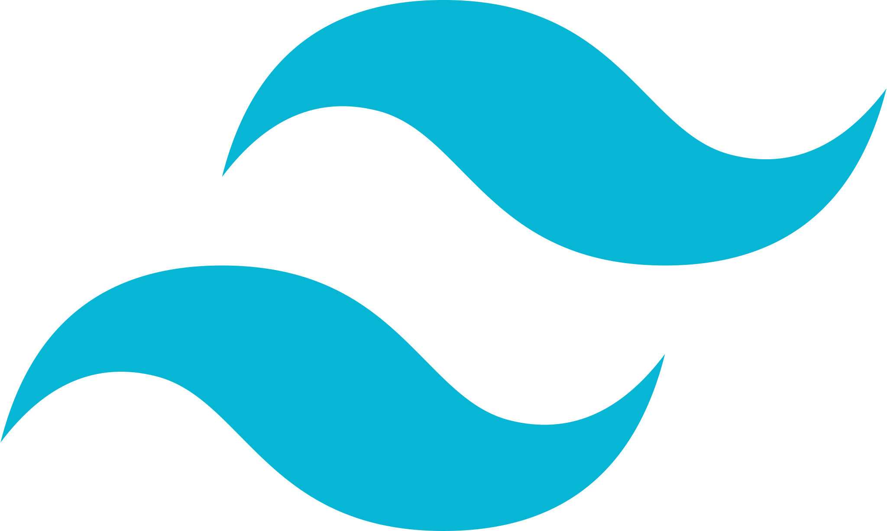
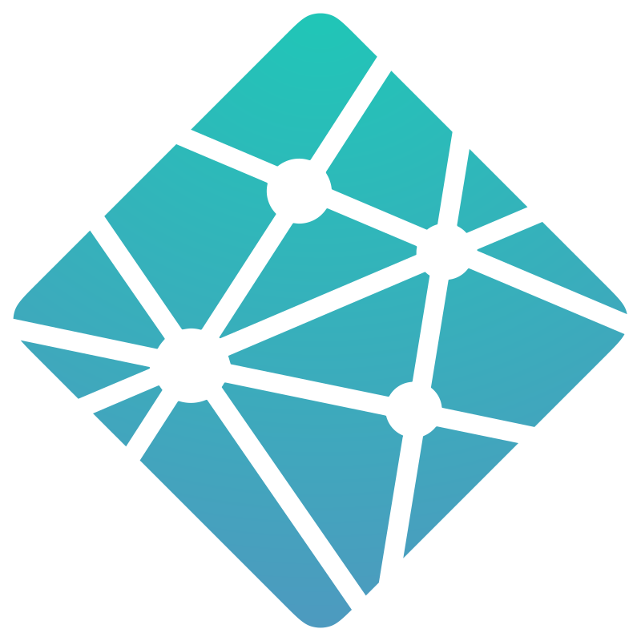

# 👨‍💻 PORTFOLIO
> *Méthodologie, choix techniques et workflow - Découvrez ma vision de l'ingénierie web à travers des cas pratiques.*


## ✨ **FONCTIONNALITÉS CLÉS**
- 🌓 **Design UI/UX** : Thème sombre natif (Carbone profond), effet Glassmorphism, animations fluides.
- ⚡ **Performances** : Optimisation maximale grâce au rendu statique d'Astro.
- 📱 **Responsive** : Interface totalement fluide et adaptée aux mobiles, tablettes et desktops.
- 🚀 **Routing dynamique** : Génération statique (SSG) des pages de projets via des fichiers Markdown.
- 📬 **Formulaire de contact** : Envoi direct d'emails via EmailJS.
- ⬆️ **Retour en haut** : Bouton pour remonter en haut de la page visible à partir de 350px de scroll.

## 🧰 **STACKS UTILISÉS**
<p align="center">
   &nbsp; &nbsp; &nbsp;
   &nbsp; &nbsp; &nbsp;
   &nbsp; &nbsp; &nbsp;
   &nbsp; &nbsp; &nbsp;
   &nbsp; &nbsp; &nbsp;
  
</p>
<br>

 `src/` : Application développée avec **[Astro](https://astro.build/) + [React](https://react.dev/) + [Tailwind CSS](https://tailwindcss.com/)**. 

 **Astro** : Générateur de site statique hyper performant gérant le Layout et le routage. <br>
 **React** : Réservé pour les composants interactifs complexes de l'interface (Island Architecture). <br>
 **Tailwind CSS** : Pour le styling utilitaire et moderne, couplé à `tailwindcss-animate`. <br>

  💡*Consulter le fichier **[PROJECT_CONFIG.md](./documentation/PROJECT_CONFIG.md)** pour les détails de l'architecture du projet.*

## ⚙️ **INSTALLATION ET LANCEMENT**
```bash
# Installer les dépendances
npm install
# Lancer le serveur de développement
npm run dev
# Construire pour la production
npm run build
```

## 🏗️ ARCHITECTURE "Astro Islands"
Ce portfolio utilise l'architecture en **[îlots d'Astro](https://docs.astro.build/fr/guides/server-islands/)**. Par défaut, tout le site (Hero, Footer, Grille de projets) est rendu en pur HTML/CSS sans aucun JavaScript client pour des performances maximales. React n'est hydraté localement (`client:visible`) que là où l'interactivité est indispensable, comme pour le formulaire de contact.

## 📝 GESTION DES DONNÉES
Les données du site sont découplées des composants. Pour ajouter un projet, il suffit d'ajouter son image dans `public/` et de mettre à jour le fichier `src/data/Projets.md`. Les pages dynamiques (`projets/[id]`) sont générées automatiquement à la compilation.

## 👨‍💻 Skies-Land - Jonathan Araldi
- **[Portfolio](https://portfolio-jonathan-araldi.netlify.app/)** | **[LinkedIn](https://www.linkedin.com/in/jonathan-araldi/)** | **[GitHub](https://github.com/Skies-Land)**